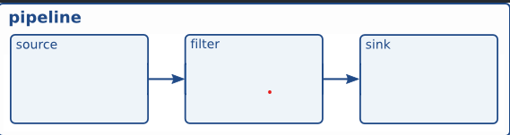
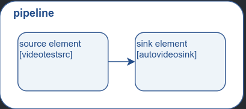

- [gstreamer概念](#gstreamer概念)
  - [相关概念](#相关概念)
  - [组合pipeline](#组合pipeline)
    - [分析](#分析)


# gstreamer概念

上一节学习了如何快速运行播放一段视频，
这次学习 gstreamer 如何手动组合一个pipeline。

## 相关概念

`element`:  
* 是gstreamer最基本的模块, 比如视频源，视频输出都视作`element`, 在处理视频数据时，想水流一样从一处处理完就往下走

下面是一个简单的pipeline图，包含基本的element  


## 组合pipeline

依旧是从一个代码demo分析
```C
#include <gst/gst.h>

#ifdef __APPLE__
#include <TargetConditionals.h>
#endif

int
tutorial_main (int argc, char *argv[])
{
  GstElement *pipeline, *source, *sink;
  GstBus *bus;
  GstMessage *msg;
  GstStateChangeReturn ret;

  /* Initialize GStreamer */
  gst_init (&argc, &argv);

  /* Create the elements */
  source = gst_element_factory_make ("videotestsrc", "source");
  sink = gst_element_factory_make ("autovideosink", "sink");

  /* Create the empty pipeline */
  pipeline = gst_pipeline_new ("test-pipeline");

  if (!pipeline || !source || !sink) {
    g_printerr ("Not all elements could be created.\n");
    return -1;
  }

  /* Build the pipeline */
  gst_bin_add_many (GST_BIN (pipeline), source, sink, NULL);
  if (gst_element_link (source, sink) != TRUE) {
    g_printerr ("Elements could not be linked.\n");
    gst_object_unref (pipeline);
    return -1;
  }

  /* Modify the source's properties */
  g_object_set (source, "pattern", 0, NULL);

  /* Start playing */
  ret = gst_element_set_state (pipeline, GST_STATE_PLAYING);
  if (ret == GST_STATE_CHANGE_FAILURE) {
    g_printerr ("Unable to set the pipeline to the playing state.\n");
    gst_object_unref (pipeline);
    return -1;
  }

  /* Wait until error or EOS */
  bus = gst_element_get_bus (pipeline);
  msg =
      gst_bus_timed_pop_filtered (bus, GST_CLOCK_TIME_NONE,
      GST_MESSAGE_ERROR | GST_MESSAGE_EOS);

  /* Parse message */
  if (msg != NULL) {
    GError *err;
    gchar *debug_info;

    switch (GST_MESSAGE_TYPE (msg)) {
      case GST_MESSAGE_ERROR:
        gst_message_parse_error (msg, &err, &debug_info);
        g_printerr ("Error received from element %s: %s\n",
            GST_OBJECT_NAME (msg->src), err->message);
        g_printerr ("Debugging information: %s\n",
            debug_info ? debug_info : "none");
        g_clear_error (&err);
        g_free (debug_info);
        break;
      case GST_MESSAGE_EOS:
        g_print ("End-Of-Stream reached.\n");
        break;
      default:
        /* We should not reach here because we only asked for ERRORs and EOS */
        g_printerr ("Unexpected message received.\n");
        break;
    }
    gst_message_unref (msg);
  }

  /* Free resources */
  gst_object_unref (bus);
  gst_element_set_state (pipeline, GST_STATE_NULL);
  gst_object_unref (pipeline);
  return 0;
}

int
main (int argc, char *argv[])
{
#if defined(__APPLE__) && TARGET_OS_MAC && !TARGET_OS_IPHONE
  return gst_macos_main ((GstMainFunc) tutorial_main, argc, argv, NULL);
#else
  return tutorial_main (argc, argv);
#endif
}
```

### 分析

```C
source = gst_element_factory_make ("videotestsrc", "source");
sink = gst_element_factory_make ("autovideosink", "sink");
```
这里是创建了一个测试类型的输入端element和一个自动检测video属性并输出到窗口的element
* 第一个参数是`element`类型, 这个类型不是随便起的，如果不知道类型名，可以利用`gst-inspect-1.0`这个自带的辅助工具查询，后面会详细讲
* 第二个参数是自定义`element`的名字


```C
pipeline = gst_pipeline_new ("test-pipeline");
```

顾名思义，创建pipeline


```C
  /* Build the pipeline */
  gst_bin_add_many (GST_BIN (pipeline), source, sink, NULL);
  if (gst_element_link (source, sink) != TRUE) {
    g_printerr ("Elements could not be linked.\n");
    gst_object_unref (pipeline);
    return -1;
  }
```

* 把创建好的element都加入到pipeline中
* 将element连接起来

> 这里插入额外的点：pipeline其实是一个特殊类型的bin, 那么我们就可以操作bin一样去控制pipeline，
> bin 是什么东西呢？

**bin**：
* 是一个容器，可以包含多个element，**可以将多个element进行分组管理**
* 从父子关系看，bin继承自element，意味着可以像控制element一样控制bin

如下图：




```C
g_object_set (source, "pattern", 0, NULL);
```
设置视频源模式，是`videotestsrc`下的子属性，这个参数具体可以取什么值，可以用`gst-inspect-1.0`查看，这里0是指输出三色条纹视频


```C
ret = gst_element_set_state (pipeline, GST_STATE_PLAYING);
```
这里是设置pipeline的属性设置为播放，这样就会自动播放视频  

这里涉及一个知识点
* 属性
  * 因为gstreamer使用glib框架，并且其`GObject`是gstreamer的基类，所以gstreamer利用其属性机制用来修改element的内部属性

> glib 部分这里不涉及，而且本人也是边学gstreamer边看glib。就不详写了


```C
  bus = gst_element_get_bus (pipeline);
```
这个语句是获取pipeline的总线，什么是总线呢？  

**总线**
* 负责把element里面抛出的消息**按顺序**发送到上层应用的通道


那么应用怎么拿到这个消息呢？

```C
  msg =
      gst_bus_timed_pop_filtered (bus, GST_CLOCK_TIME_NONE,
      GST_MESSAGE_ERROR | GST_MESSAGE_EOS);
```
这条代码就是从总线中拿到消息的。并且是可阻塞的

* 第一个参数是指定总线
* 第二个参数是指定超时时间 
  * 单位是**纳秒**
  * `GST_CLOCK_TIME_NONE`表示一直阻塞
  * 如果想使用秒数可以使用 `GST_SECOND`, 毫秒`GST_MSECOND`, 微秒`GST_USECOND`
* 第三个参数是指定获取的消息类型
