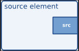
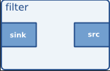
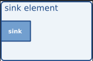
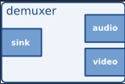
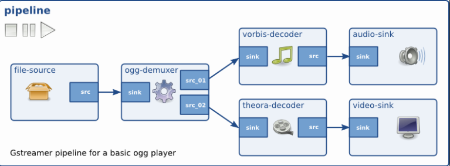

- [动态pipeline](#动态pipeline)
  - [介绍](#介绍)
  - [pad](#pad)
  - [例子](#例子)
    - [分析](#分析)
  - [gstreamer的状态](#gstreamer的状态)


# 动态pipeline

这章主要把剩余的一些重要的概念介绍完，这样就是可以实现动态创建pipeline，这样就不需要预先创建pipeline。
同时，通过学完这些概念，就可以去学 [回放](./回放教程.md)。

## 介绍

想象一下这样的场景：你现在需要用gstreamer打开一个视频文件，这个视频文件你不知道其码流格式，音频格式，有多少路音频等，
那么按之前的方法，你没法预先创建好pipeline从而播放视频，这时候动态创建pipeline就有必要了。

## pad

我们知道，在gstreamer里面视频数据流会在各个element之间流动，而element是怎么接收或者传递这些数据流的呢？

`pad`就是专门负责在element 进行接收/传递数据流，对应数据结构是`GstPad`

* 一般来说，sink pad是指负责接收的pad，src pad负责传递出去
* 一个element 至少有一个pad，比如：数据源element只有一个传递的pad，过滤器element有2个，解复用器(demuxer)就可能有3个


     

这里举个简单的视频播放的pipeline



## 例子
这里看一个音频pipeline的例子:

```C
#include <gst/gst.h>

#ifdef __APPLE__
#include <TargetConditionals.h>
#endif

/* Structure to contain all our information, so we can pass it to callbacks */
typedef struct _CustomData
{
  GstElement *pipeline;
  GstElement *source;
  GstElement *convert;
  GstElement *resample;
  GstElement *sink;
} CustomData;

/* Handler for the pad-added signal */
static void pad_added_handler (GstElement * src, GstPad * pad,
    CustomData * data);

int
tutorial_main (int argc, char *argv[])
{
  CustomData data;
  GstBus *bus;
  GstMessage *msg;
  GstStateChangeReturn ret;
  gboolean terminate = FALSE;

  /* Initialize GStreamer */
  gst_init (&argc, &argv);

  /* Create the elements */
  data.source = gst_element_factory_make ("uridecodebin", "source");
  data.convert = gst_element_factory_make ("audioconvert", "convert");
  data.resample = gst_element_factory_make ("audioresample", "resample");
  data.sink = gst_element_factory_make ("autoaudiosink", "sink");

  /* Create the empty pipeline */
  data.pipeline = gst_pipeline_new ("test-pipeline");

  if (!data.pipeline || !data.source || !data.convert || !data.resample
      || !data.sink) {
    g_printerr ("Not all elements could be created.\n");
    return -1;
  }

  /* Build the pipeline. Note that we are NOT linking the source at this
   * point. We will do it later. */
  gst_bin_add_many (GST_BIN (data.pipeline), data.source, data.convert,
      data.resample, data.sink, NULL);
  if (!gst_element_link_many (data.convert, data.resample, data.sink, NULL)) {
    g_printerr ("Elements could not be linked.\n");
    gst_object_unref (data.pipeline);
    return -1;
  }

  /* Set the URI to play */
  g_object_set (data.source, "uri",
      "https://gstreamer.freedesktop.org/data/media/sintel_trailer-480p.webm",
      NULL);

  /* Connect to the pad-added signal */
  g_signal_connect (data.source, "pad-added", G_CALLBACK (pad_added_handler),
      &data);

  /* Start playing */
  ret = gst_element_set_state (data.pipeline, GST_STATE_PLAYING);
  if (ret == GST_STATE_CHANGE_FAILURE) {
    g_printerr ("Unable to set the pipeline to the playing state.\n");
    gst_object_unref (data.pipeline);
    return -1;
  }

  /* Listen to the bus */
  bus = gst_element_get_bus (data.pipeline);
  do {
    msg = gst_bus_timed_pop_filtered (bus, GST_CLOCK_TIME_NONE,
        GST_MESSAGE_STATE_CHANGED | GST_MESSAGE_ERROR | GST_MESSAGE_EOS);

    /* Parse message */
    if (msg != NULL) {
      GError *err;
      gchar *debug_info;

      switch (GST_MESSAGE_TYPE (msg)) {
        case GST_MESSAGE_ERROR:
          gst_message_parse_error (msg, &err, &debug_info);
          g_printerr ("Error received from element %s: %s\n",
              GST_OBJECT_NAME (msg->src), err->message);
          g_printerr ("Debugging information: %s\n",
              debug_info ? debug_info : "none");
          g_clear_error (&err);
          g_free (debug_info);
          terminate = TRUE;
          break;
        case GST_MESSAGE_EOS:
          g_print ("End-Of-Stream reached.\n");
          terminate = TRUE;
          break;
        case GST_MESSAGE_STATE_CHANGED:
          /* We are only interested in state-changed messages from the pipeline */
          if (GST_MESSAGE_SRC (msg) == GST_OBJECT (data.pipeline)) {
            GstState old_state, new_state, pending_state;
            gst_message_parse_state_changed (msg, &old_state, &new_state,
                &pending_state);
            g_print ("Pipeline state changed from %s to %s:\n",
                gst_state_get_name (old_state), gst_state_get_name (new_state));
          }
          break;
        default:
          /* We should not reach here */
          g_printerr ("Unexpected message received.\n");
          break;
      }
      gst_message_unref (msg);
    }
  } while (!terminate);

  /* Free resources */
  gst_object_unref (bus);
  gst_element_set_state (data.pipeline, GST_STATE_NULL);
  gst_object_unref (data.pipeline);
  return 0;
}

/* This function will be called by the pad-added signal */
static void
pad_added_handler (GstElement * src, GstPad * new_pad, CustomData * data)
{
  GstPad *sink_pad = gst_element_get_static_pad (data->convert, "sink");
  GstPadLinkReturn ret;
  GstCaps *new_pad_caps = NULL;
  GstStructure *new_pad_struct = NULL;
  const gchar *new_pad_type = NULL;

  g_print ("Received new pad '%s' from '%s':\n", GST_PAD_NAME (new_pad),
      GST_ELEMENT_NAME (src));

  /* If our converter is already linked, we have nothing to do here */
  if (gst_pad_is_linked (sink_pad)) {
    g_print ("We are already linked. Ignoring.\n");
    goto exit;
  }

  /* Check the new pad's type */
  new_pad_caps = gst_pad_get_current_caps (new_pad);
  new_pad_struct = gst_caps_get_structure (new_pad_caps, 0);
  new_pad_type = gst_structure_get_name (new_pad_struct);
  if (!g_str_has_prefix (new_pad_type, "audio/x-raw")) {
    g_print ("It has type '%s' which is not raw audio. Ignoring.\n",
        new_pad_type);
    goto exit;
  }

  /* Attempt the link */
  ret = gst_pad_link (new_pad, sink_pad);
  if (GST_PAD_LINK_FAILED (ret)) {
    g_print ("Type is '%s' but link failed.\n", new_pad_type);
  } else {
    g_print ("Link succeeded (type '%s').\n", new_pad_type);
  }

exit:
  /* Unreference the new pad's caps, if we got them */
  if (new_pad_caps != NULL)
    gst_caps_unref (new_pad_caps);

  /* Unreference the sink pad */
  gst_object_unref (sink_pad);
}

int
main (int argc, char *argv[])
{
#if defined(__APPLE__) && TARGET_OS_MAC && !TARGET_OS_IPHONE
  return gst_macos_main ((GstMainFunc) tutorial_main, argc, argv, NULL);
#else
  return tutorial_main (argc, argv);
#endif
}
```
### 分析

```C
  /* Create the elements */
  data.source = gst_element_factory_make ("uridecodebin", "source");
  data.convert = gst_element_factory_make ("audioconvert", "convert");
  data.resample = gst_element_factory_make ("audioresample", "resample");
  data.sink = gst_element_factory_make ("autoaudiosink", "sink");
```

* 这里创建了4个element：
  * `uridecodebin`: 用于自动解析多媒体uri拉取对应码流并解码
  * `audioconvert`: 用于音频格式转换
  * `audioresample`: 对音频进行重采样
  * `autoaudiosink`: 用来自动接收并播放音频

```C
  /* Create the empty pipeline */
  data.pipeline = gst_pipeline_new ("test-pipeline");

  /* Build the pipeline. Note that we are NOT linking the source at this
   * point. We will do it later. */
  gst_bin_add_many (GST_BIN (data.pipeline), data.source, data.convert,
      data.resample, data.sink, NULL);
  if (!gst_element_link_many (data.convert, data.resample, data.sink, NULL)) {
    g_printerr ("Elements could not be linked.\n");
    gst_object_unref (data.pipeline);
    return -1;
  }
```

* 创建了一个叫 test-pipeline的pipeline
* 把各个element加入到这个pipeline
* 把convert resample sink连接起来
* 这里先不把source 和 把convert连接，因为此时 source 还没有解析获取音频信息，不能创建pad，所以不能连接其他element

```C
  g_object_set (data.source, "uri",
      "https://gstreamer.freedesktop.org/data/media/sintel_trailer-480p.webm",
      NULL);
```

* 设置source的uri属性，后续source会根据这个uri去获取码流

```C
  /* Connect to the pad-added signal */
  g_signal_connect (data.source, "pad-added", G_CALLBACK (pad_added_handler),
      &data);
```

* 这里使用了glib的信号机制，类似QT的信号槽，将source的 `pad-added`信号绑定到指定回调函数
* 什么时候触发这个信号呢？
  * 只有source将码流拉取下来，然后解析其视频相关信息后，就会创建自身的pad, 这时候就会触发

> 具体还有什么信号，可以通过`gst-inspect-1.0` 查看不同element有不同信号


```C
static void
pad_added_handler (GstElement * src, GstPad * new_pad, CustomData * data)
```
* `src` 是触发回调的element
* `new_pad` 是`src`这个element 新创建的pad
* `data` 是用户自定义参数


```C
/* Check the new pad's type */
  new_pad_caps = gst_pad_get_current_caps (new_pad);
  new_pad_struct = gst_caps_get_structure (new_pad_caps, 0);
  new_pad_type = gst_structure_get_name (new_pad_struct);
  if (!g_str_has_prefix (new_pad_type, "audio/x-raw")) {
    g_print ("It has type '%s' which is not raw audio. Ignoring.\n",
        new_pad_type);
    goto exit;
  }
```
这里是想获取新的pad 是否是我们需要的，如果不是就跳过，因为在这里例子里面我们只需要audio相关的pad, 同时这里也涉及几个知识点：
* `pad`的capabilities：`GstCaps`
* `GstStructure`: 保存媒体相关信息的结构体


## gstreamer的状态

我们知道
```gst_element_set_state (data.pipeline, GST_STATE_PLAYING);```
是用来设置播放状态的，那么还有一些其他的状态吗？答案是肯定的

| 状态        | 描述       |
| :--------- | :--------   |
|     NULL   |  默认状态         |
|   READY    |  当前element已经准备可以到下一个状态PAUSED|
|   PAUSED   |  该元素处于暂停状态，已准备好接收并处理数据。然而，接收端元素仅接受一个缓冲区，然后就会阻塞。|
|   PLAYING  |  处于播放状态|

**你只能在相邻的状态切换，例如只能从READY -> PAUSED, 不能从NULL -> PAUSED**