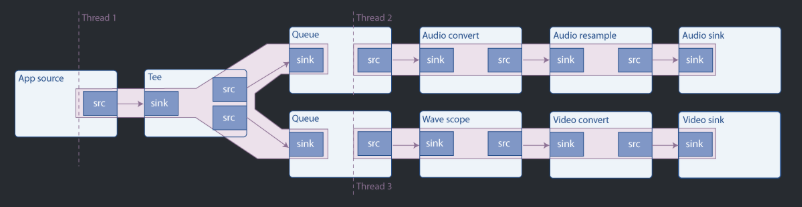

- [多线程和Pad可用性](#多线程和pad可用性)
  - [介绍](#介绍)
    - [多线程](#多线程)
    - [Request Pad](#request-pad)


# 多线程和Pad可用性

gstreamer在实际应用中会在内部自动使用多线程方式处理音视频，但是在一些情况下，你需要主动去解耦多线程。这章只要就讲这个，同时还会讲Pad的可用性

## 介绍

### 多线程

gstreamer是个多线程的框架，内部会创建和销毁线程，比如将流处理与用户线程分离，而gstreamer的插件也可以进行多线程操作的，比如解码器解码流程会用多线程。

那用户可以自定义多线程处理吗？ 答案是肯定的

* 可以用`queue` element实现
* 在线程1中`src` pad将数据入队，在另外一个线程中`sink` pad在将数据取出并处理



如图示，在整个pipeline中，数据源是一段音频数据
* 在线程1中，包含了从数据源中获取数据，通过`tee` element将数据分流一端发送到声卡进行播放，一端进行分析并通过虚拟示波器进行展示
* `queue` element 会创建一个新的线程，所以这里会有3个线程

一般情况下，如果有多个接收端，那么就需要多线程处理，如果是同步的话，因为接收端`sink`内部是阻塞操作，只要一阻塞，那么其他`sink`就不能操作，导致各种延迟问题出现

### Request Pad

* 在 [动态pipeline](#动态pipeline)中我们用了`uridecodebin` element, 这个element一开始是没有Pad的，只有是启动了pipeline后获取了码流信息后才创建了pad。

* 这种只有通过获取码流并解析后才能创建的Pad叫 *Sometimes Pads*

* 与之对比，常规的Pad被称为 *Alaways Pads*.

* 还有第三种叫 *Request Pads*, 这种就是按需创建的。最典型的例子就是前面图中展示的 `tee` element，它只有一个固定的`sink` 但是没有`src`，需要手动请求并加入到`tee`中，*并且可以申请多个，这样就可以把码流复制成多份流向不同端口*，唯一不好的地方就是，相比Alaways Pads需要手动申请并连接。

> 需要注意的是，如果要请求或释放Pad, 在`PLAYING`或`PAUSED`下需要考虑Pad阻塞的情况，最安全的方式就是就是在
> `NULL` 或`READY`下进行

下面是代码例子

```C++
#include <stdio.h>
#include "gst/gst.h"

#define RETURN_IF_NULL(p, arg) do{\
    if(!p){\
        printf(arg"\n");\
        return 0;\
    }\
}while(0)
    
int main()
{
    GstBus *bus;
    GstMessage *msg;
    GstElement* pipeline, *tee, *audio_source;
    GstElement* audio_queue, *audio_convert, *audio_resample, *audio_sink;
    GstElement* video_queue, *wave_scope, *video_convert, *video_sink;
    GstPad* audio_queue_pad, *video_queue_pad, *tee_audio_pad, *tee_video_pad;

    gst_init(NULL, NULL);

    pipeline = gst_pipeline_new("tpipeline");
    RETURN_IF_NULL(pipeline, "pipeline err");

    tee = gst_element_factory_make("tee", "tee");
    RETURN_IF_NULL(tee, "tee err");
    
    audio_source = gst_element_factory_make("audiotestsrc", "audio_src");
    RETURN_IF_NULL(audio_source, "audio_source err");

    audio_queue = gst_element_factory_make("queue", "audio_q");
    RETURN_IF_NULL(audio_queue, "audio_queue err");
    
    audio_convert  = gst_element_factory_make("audioconvert", "audio_convert");
    RETURN_IF_NULL(audio_convert, "audio_convert err");
    
    audio_resample = gst_element_factory_make("audioresample", "auido_resample");
    RETURN_IF_NULL(audio_resample, "audio_resample err");

    audio_sink = gst_element_factory_make("autoaudiosink", "audio_sink");
    RETURN_IF_NULL(audio_sink, "video_sink err");

    video_queue = gst_element_factory_make("queue", "video_q");
    RETURN_IF_NULL(video_queue, "video_queue err");
    
    video_convert = gst_element_factory_make("videoconvert", "video_convert");
    RETURN_IF_NULL(video_convert, "video_convert err");
    
    wave_scope = gst_element_factory_make("monoscope", "wave_scope");
    RETURN_IF_NULL(wave_scope, "wave_scope err");

    video_sink = gst_element_factory_make("autovideosink", "video_sink");
    RETURN_IF_NULL(video_sink, "video_sink err");

    g_object_set(audio_source, "freq", 1000.0f, NULL);

    gst_bin_add_many (GST_BIN(pipeline), audio_source, tee, audio_queue, audio_convert, audio_resample, audio_sink,
      video_queue, wave_scope, video_convert, video_sink, NULL);
    if (gst_element_link_many (audio_source, tee, NULL) != TRUE ||
        gst_element_link_many (audio_queue, audio_convert, audio_resample, audio_sink, NULL) != TRUE ||
        gst_element_link_many (video_queue, wave_scope, video_convert, video_sink, NULL) != TRUE) 
    {
        g_printerr ("Elements could not be linked.\n");
        gst_object_unref (pipeline);
        return -1;
    }

    tee_audio_pad = gst_element_request_pad_simple(tee, "src_%u");
    g_print ("Obtained request pad %s for audio branch.\n", gst_pad_get_name (tee_audio_pad));
    audio_queue_pad = gst_element_get_static_pad(audio_queue, "sink"); 
    
    tee_video_pad = gst_element_request_pad_simple(tee, "src_%u");
    g_print ("Obtained request pad %s for video branch.\n", gst_pad_get_name (tee_video_pad));
    video_queue_pad = gst_element_get_static_pad(video_queue, "sink");

    if(gst_pad_link(tee_audio_pad, audio_queue_pad) != GST_PAD_LINK_OK 
        || gst_pad_link(tee_video_pad, video_queue_pad) != GST_PAD_LINK_OK)
    {
        g_print("pad link err\n");

        gst_object_unref(pipeline);

        return 0;
    }

    gst_element_set_state(pipeline, GST_STATE_PLAYING);

    bus = gst_element_get_bus (pipeline);
    msg = gst_bus_timed_pop_filtered (bus, GST_CLOCK_TIME_NONE, GST_MESSAGE_ERROR | GST_MESSAGE_EOS);


    gst_object_unref(tee_audio_pad);
    gst_object_unref(tee_video_pad);

    gst_element_release_request_pad(tee, tee_audio_pad);
    gst_element_release_request_pad(tee, tee_video_pad);

    gst_object_unref(bus);
    gst_message_unref(msg);

    gst_element_set_state(pipeline, GST_STATE_NULL);

    gst_object_unref(pipeline);

    return 0;
}
```

前面各种element创建无须赘述，看重点的
```C++
tee_audio_pad = gst_element_request_pad_simple(tee, "src_%u");
g_print ("Obtained request pad %s for audio branch.\n", gst_pad_get_name (tee_audio_pad));
audio_queue_pad = gst_element_get_static_pad(audio_queue, "sink"); 

tee_video_pad = gst_element_request_pad_simple(tee, "src_%u");
g_print ("Obtained request pad %s for video branch.\n", gst_pad_get_name (tee_video_pad));
video_queue_pad = gst_element_get_static_pad(video_queue, "sink");

if(gst_pad_link(tee_audio_pad, audio_queue_pad) != GST_PAD_LINK_OK 
    || gst_pad_link(tee_video_pad, video_queue_pad) != GST_PAD_LINK_OK)
{
    g_print("pad link err\n");

    gst_object_unref(pipeline);

    return 0;
}

// ....

gst_object_unref(tee_audio_pad);
gst_object_unref(tee_video_pad);
gst_element_release_request_pad(tee, tee_audio_pad);
gst_element_release_request_pad(tee, tee_video_pad);
```
* 这里先申请了2个Pad，要注意，一个element可能有多种Pad，那么在申请时就要注意申请哪种(从文档得知 `tee` element 只有2中Pad，一个是"sink" 一个是"src_%u")
* 获取了Pad后要连接，那么要连接到`queue` element，那么就要获取 `queue`的Pad，并连接起来，一般来说 Alaways Pad用`gst_element_get_static_pad()`获取
* 使用完后记得解引用和释放

> 注意的是 `gst_element_link_many()`其实也是可以自动连接 Request Pad的，但是这里为什么没有这样用呢，
> 因为就算内部自动连接了，但是结束时仍然需要手动释放，而用了自动连接，我们会很容易忘记释放从而造成内存泄漏